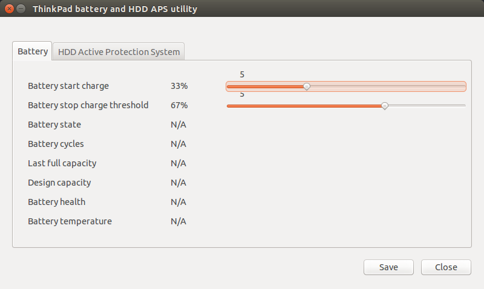

# tp-utils - ThinkPad utilities for advanced battery management and monitoring HDD state

Written in Python using wxWidgets GUI library, relies on tp_smapi and HDAPS API.

Note: This will not work on newer laptops such as T430 as tp_smapi no longer works.



## Installation (Ubuntu)
* Install wx toolkit http://wiki.wxpython.org/How%20to%20install%20wxPython
```bash
# apt-get install python-wxgtk2.8
```
* Install Tp_smapi
```bash
# apt-get install tp-smapi-dkms
```
* Enable Tp_smapi
```bash
# modprobe -v tp_smapi
```

## Running
```bash
# ./think-utils
```

## More information
* http://www.thinkwiki.org/wiki/Tp_smapi
* http://www.thinkwiki.org/wiki/HDAPS
